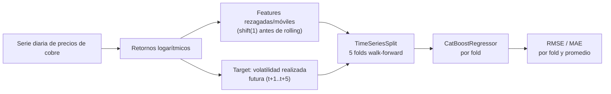

<div align="center">

# Copper Volatility Forecaster

**[English](README.md) | [Español](README.es.md)**


</div>

## Descripción general

Este proyecto pronostica la **volatilidad realizada futura** del precio del
cobre: dado un historial de precios diarios, el modelo estima cuán volátil
será el precio durante los **próximos 5 días hábiles**. Este tipo de
pronóstico es un insumo estándar para el dimensionamiento de coberturas
(hedging), el pricing de opciones y la calibración de límites de riesgo para
cualquier mesa o empresa con exposición al precio del cobre — un problema
directamente relevante para Chile como mayor productor mundial de cobre,
donde los ingresos de la minería, la planificación presupuestaria nacional y
los programas de cobertura corporativa son sensibles a la volatilidad del
precio del cobre.

## Valor de negocio

- **Dimensionamiento de riesgo**: una estimación de volatilidad futura
  permite a una tesorería o mesa de trading dimensionar posiciones de
  cobertura (futuros, collares de opciones) según un presupuesto de riesgo
  objetivo, en lugar de una regla empírica estática.
- **Insumo para pricing de opciones**: los pronósticos de volatilidad
  realizada son un insumo directo para el pricing y la valorización de
  derivados de cobre OTC o poco líquidos, donde no siempre se dispone de una
  superficie de volatilidad implícita.
- **Sensibilidad presupuestaria y de planificación**: para operaciones
  exportadoras de cobre, saber si el mercado está entrando en un régimen de
  alta o baja volatilidad informa cuán conservadoras deben construirse las
  proyecciones de ingresos y los covenants financieros.

## Arquitectura



El pipeline tiene tres etapas:

1. **Capa de datos** — carga una serie diaria de precios y calcula los
   retornos logarítmicos.
2. **Capa de ingeniería de características** (Polars) — construye
   características de volatilidad móvil, retorno medio móvil, retornos
   rezagados de corto plazo y variables de calendario, todas calculadas
   estrictamente con información disponible antes del día que se pronostica.
3. **Capa de modelado y validación** — un `CatBoostRegressor` entrenado y
   evaluado en cinco folds walk-forward generados por `TimeSeriesSplit` de
   scikit-learn, de modo que cada fold de validación es cronológicamente
   posterior a su fold de entrenamiento.

## Stack tecnológico

| Capa | Tecnología | Rol |
|---|---|---|
| Manipulación de datos | **Polars** | Ingeniería de características rápida y basada en expresiones sobre la serie de precios/retornos |
| Modelado | **CatBoost** | Regresor de gradient boosting para el target de volatilidad |
| Validación | **scikit-learn** (`TimeSeriesSplit`) | Validación cruzada walk-forward estricta |
| Búsqueda de hiperparámetros | **Optuna** | Instalado y conectado para la fase de ajuste (ver Próximos pasos) |
| Entorno de ejecución | **Python 3.10** | Línea base del proyecto |

## Metodología: evitar la fuga de datos futuros (lookahead bias)

Los pipelines de pronóstico de volatilidad son particularmente propensos a la
fuga de datos, porque el valor "futuro" que se pronostica (la volatilidad
realizada) se deriva de la misma serie de retornos de donde salen las
características. Se imponen dos reglas en todo el pipeline:

1. **Cada característica se construye a partir de retornos desplazados al
   menos un día** antes de aplicar cualquier ventana móvil, de modo que una
   característica calculada para el día *t* nunca usa el retorno realizado
   ese mismo día *t*.
2. **La validación cruzada usa exclusivamente `TimeSeriesSplit`** — una
   división walk-forward donde cada fold de validación es estrictamente
   posterior en el tiempo a su fold de entrenamiento. Nunca se usa un K-fold
   aleatorio con mezcla, ya que permitiría que el modelo entrene con
   regímenes de volatilidad futuros y valide contra el pasado.

## Datos

Esta versión se ejecuta sobre una serie diaria simulada de precios de cobre
con agrupamiento de volatilidad tipo GARCH(1,1), de modo que la serie tiene
regímenes de volatilidad genuinos y recuperables, en lugar de ruido plano sin
estructura. Esto permite ejercitar y validar el pipeline completo —
ingeniería de características, validación walk-forward y ajuste del modelo —
de punta a punta antes de conectar una fuente de datos de mercado real (ver
Próximos pasos).

## Características (features)

| Característica | Descripción |
|---|---|
| `realized_vol_{5,10,20,60}d` | Desviación estándar móvil de retornos pasados |
| `mean_return_{5,10,20,60}d` | Media móvil de retornos pasados |
| `lag_return_{1,2,3}` | Retorno de hace 1/2/3 días |
| `day_of_week`, `month` | Variables de calendario, conocidas de antemano |

**Target**: `target_fwd_realized_vol` — desviación estándar de los retornos
entre los días *t+1* y *t+5*, la magnitud que el modelo pronostica.

## Resultados

Salida de una corrida completa (3.000 días hábiles simulados, 2.934 filas
tras construir features/target, `TimeSeriesSplit` de 5 folds):

```
[fold 1/5] train=  489 val=  489 RMSE=0.002423 MAE=0.001915
[fold 2/5] train=  978 val=  489 RMSE=0.002900 MAE=0.002315
[fold 3/5] train= 1467 val=  489 RMSE=0.002657 MAE=0.002195
[fold 4/5] train= 1956 val=  489 RMSE=0.003262 MAE=0.002560
[fold 5/5] train= 2445 val=  489 RMSE=0.002471 MAE=0.002000
------------------------------------------------------------
CV mean RMSE: 0.002743 (+/- 0.000309)
CV mean MAE : 0.002197 (+/- 0.000230)
```

RMSE/MAE están expresados en unidades de retorno logarítmico diario, la misma
escala que el propio target de volatilidad. Un RMSE promedio de ~0.0027
significa que el pronóstico de volatilidad futura a 5 días se equivoca en
promedio por unos 0.27 puntos porcentuales de volatilidad de retorno diario,
un margen pequeño frente a los movimientos diarios de ~1-3% que produce el
proceso subyacente.

## Cómo empezar

```powershell
py -m venv venv
./venv/Scripts/pip install -r requirements.txt
./venv/Scripts/python main.py
```

## Próximos pasos

- Conectar una serie real de precios de cobre (futuros LME/COMEX).
- Agregar un estudio de Optuna para ajustar los hiperparámetros de CatBoost por fold.
- Agregar análisis de importancia de características con SHAP.

## Autor

**Pablo Reyes**

## Licencia

MIT — ver [LICENSE](LICENSE).
