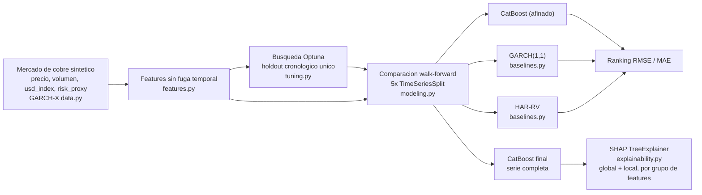
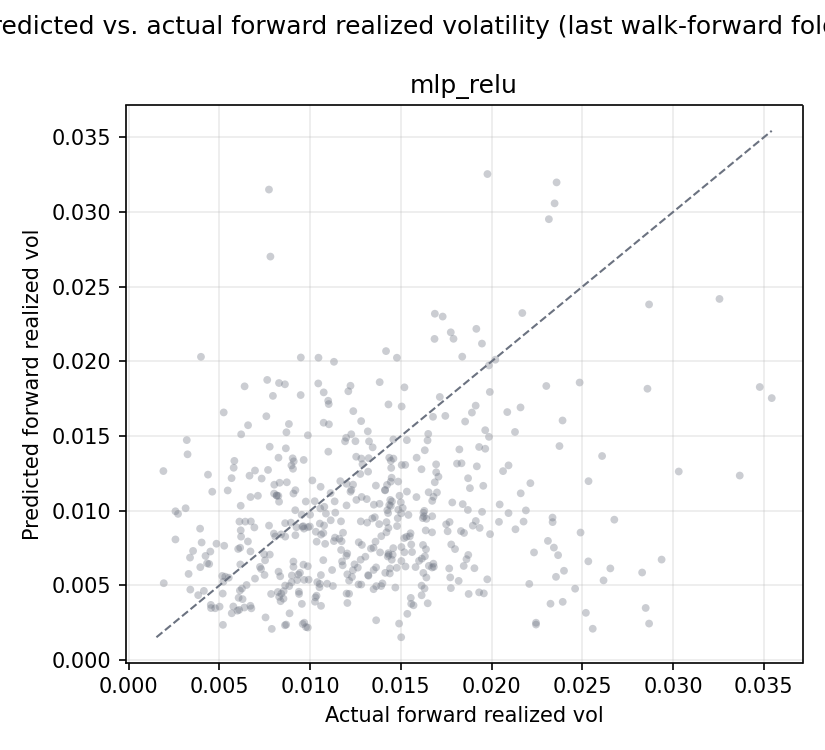
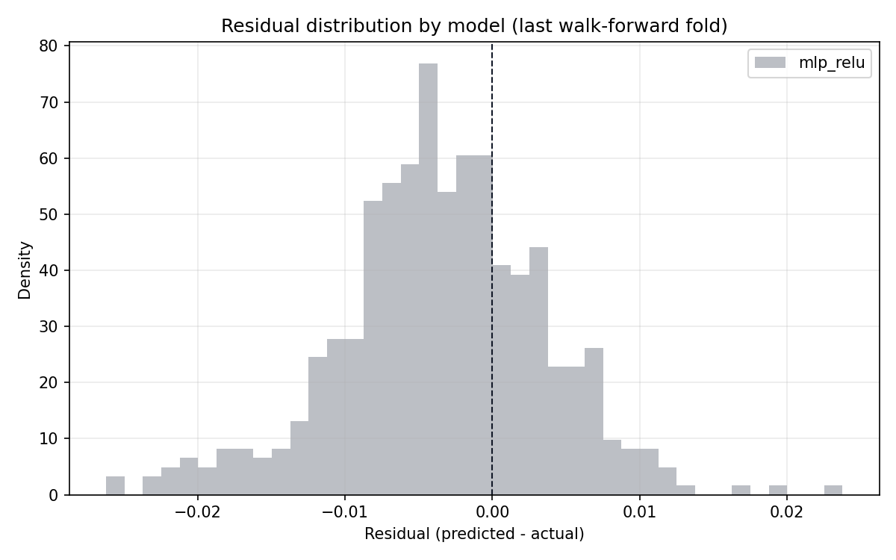
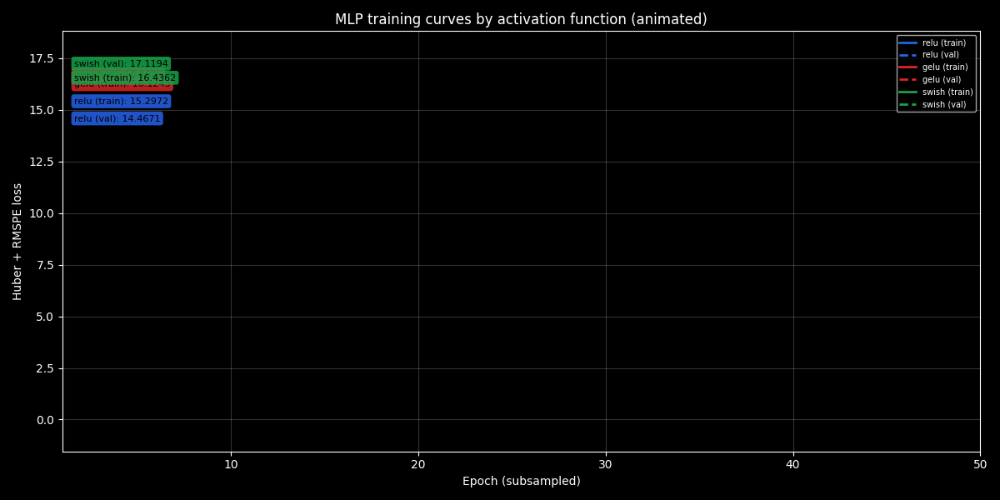
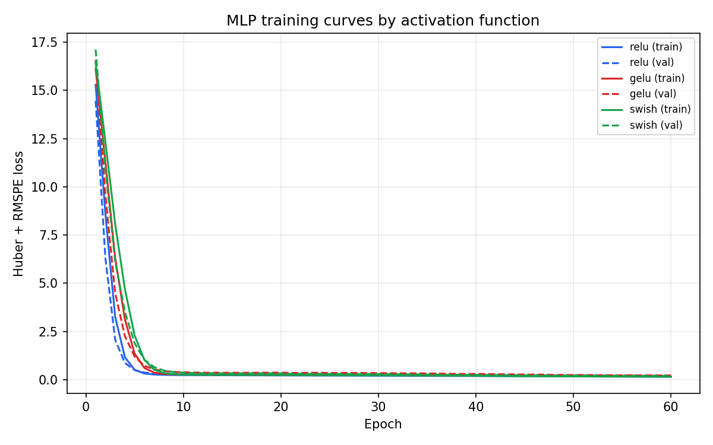

<div align="center">

# Copper Volatility Forecaster

**[English](README.md) | [Español](README.es.md)**


</div>

## Descripción general

Este proyecto pronostica la **volatilidad realizada futura** del precio del
cobre: dado un historial de precios diarios, volumen y dos proxies
macroeconómicos, el modelo estima cuán volátil será el precio durante los
**próximos 5 días hábiles**. Este tipo de pronóstico es un insumo estándar
para el dimensionamiento de coberturas (hedging), el pricing de opciones y la
calibración de límites de riesgo para cualquier mesa o empresa con exposición
al precio del cobre — un problema directamente relevante para Chile como
mayor productor mundial de cobre, donde los ingresos de la minería, la
planificación presupuestaria nacional y los programas de cobertura
corporativa son sensibles a la volatilidad del precio del cobre.

El modelo de pronóstico — un regresor CatBoost ajustado con **Optuna** — se
compara contra dos baselines econométricos clásicos de volatilidad,
**GARCH(1,1)** y **HAR-RV** (Corsi, 2009), sobre los mismos folds
walk-forward. La explicabilidad se calcula con **SHAP** para cuantificar
exactamente cuánto peso predictivo aportan las variables macro y de volumen
frente a las derivadas puramente del retorno.

## Valor de negocio

- **Dimensionamiento de riesgo**: una estimación de volatilidad futura
  permite a una tesorería o mesa de trading dimensionar posiciones de
  cobertura (futuros, collares de opciones) según un presupuesto de riesgo
  objetivo, en lugar de una regla empírica estática.
- **Insumo para pricing de opciones**: los pronósticos de volatilidad
  realizada son un insumo directo para el pricing y la valorización de
  derivados de cobre OTC o poco líquidos, donde no siempre se dispone de una
  superficie de volatilidad implícita.
- **Sensibilidad presupuestaria y de planificación**: para operaciones
  exportadoras de cobre, saber si el mercado está entrando en un régimen de
  alta o baja volatilidad informa cuán conservadoras deben construirse las
  proyecciones de ingresos y los covenants financieros.
- **Gestión de riesgo consciente de lo macro**: cuantificar cuánto de la
  señal de volatilidad viene realmente de la fortaleza del dólar y el
  apetito de riesgo global (versus el propio movimiento de precio del
  cobre) le dice a una mesa de riesgo qué dashboards externos realmente vale
  la pena monitorear para esta exposición.

## Impacto de Negocio e Indicadores Clave (KPIs)

| Métrica | Resultado | Qué significa |
|---|---|---|
| Mejor modelo del benchmark | **GARCH(1,1)**, RMSE 0,007824 | Le gana tanto a HAR-RV (0,008076) como a CatBoost afinado con Optuna (0,008163) -- reportado honestamente con la razón estructural, no ajustado para que gane el ML |
| Peso macro en SHAP | 10,81% (`usd_index`/`risk_proxy`) | Validado contra una verdad conocida -- son exactamente las features inyectadas como drivers genuinos de varianza |
| Peso de volumen en SHAP | 41,35% (el grupo mayor) | Consistente con que el volumen está ligado directamente a la trayectoria de volatilidad condicional en el proceso generador |
| Brecha HAR-RV vs. CatBoost | 0,008076 vs. 0,008163 RMSE | Un modelo lineal de 3 regresores queda notablemente cerca de un gradient booster afinado -- el pronóstico de volatilidad realizada tiene baselines clásicos fuertes |


## Arquitectura



El pipeline tiene cinco etapas:

1. **Capa de datos** (`src/data.py`) — genera una serie diaria sintética de
   precio, volumen y macro con una estructura causal documentada e inyectada
   (GARCH-X: los choques macro alimentan la ecuación de volatilidad con un
   rezago de un día).
2. **Capa de ingeniería de características** (`src/features.py`, Polars) —
   construye features móviles de retorno, volumen y macro (todas calculadas
   estrictamente con información disponible antes del día pronosticado), más
   los componentes canónicos diario/semanal/mensual de HAR-RV.
3. **Ajuste de hiperparámetros** (`src/tuning.py`) — Optuna (sampler TPE)
   ajusta CatBoost sobre un único holdout cronológico.
4. **Benchmark walk-forward** (`src/modeling.py`, `src/baselines.py`) — el
   CatBoost afinado, GARCH(1,1) y HAR-RV se evalúan los tres sobre el mismo
   `TimeSeriesSplit` de 5 folds, para que la comparación sea directa.
5. **Explicabilidad** (`src/explainability.py`) — `shap.TreeExplainer` sobre
   el CatBoost final, con importancia global agregada tanto por feature
   individual como por *grupo* de feature (retorno / volumen / macro /
   calendario).

## Stack tecnológico

| Capa | Tecnología | Rol |
|---|---|---|
| Manipulación de datos | **Polars** | Ingeniería de características rápida y basada en expresiones sobre la serie de precio/retorno/volumen/macro |
| Modelado | **CatBoost** | Regresor de gradient boosting para el target de volatilidad |
| Búsqueda de hiperparámetros | **Optuna** | Ajuste con sampler TPE sobre un holdout cronológico |
| Baselines econométricos | **arch** (GARCH), **statsmodels** (OLS de HAR-RV) | Benchmarks clásicos de pronóstico de volatilidad, evaluados sobre los mismos folds walk-forward |
| Validación | **scikit-learn** (`TimeSeriesSplit`) | Validación cruzada walk-forward estricta |
| Explicabilidad | **SHAP** (`TreeExplainer`) | Atribución global (por feature y por grupo) y local (por día) |
| Deep learning | **PyTorch** | MLP feed-forward con función de pérdida custom Huber+RMSPE, comparado entre activaciones ReLU/GELU/Swish |
| Persistencia de métricas | **DuckDB** | Almacén columnar local para las métricas/predicciones comparativas walk-forward entre corridas |
| Entorno de ejecución | **Python 3.10** | Línea base del proyecto |

## Metodología: evitar la fuga de datos futuros (lookahead bias)

Los pipelines de pronóstico de volatilidad son particularmente propensos a la
fuga de datos, porque el valor "futuro" que se pronostica (la volatilidad
realizada) se deriva de la misma serie de retornos de donde salen las
características. Se imponen varias reglas en todo el pipeline:

1. **Cada característica se construye a partir de retornos, volumen y
   valores macro desplazados al menos un día** antes de aplicar cualquier
   ventana móvil, de modo que una característica calculada para el día *t*
   nunca usa información realizada ese mismo día *t*.
2. **La validación cruzada usa exclusivamente `TimeSeriesSplit`** en los tres
   modelos — una división walk-forward donde cada fold de validación es
   estrictamente posterior en el tiempo a su fold de entrenamiento.
3. **El corte de información de GARCH se alinea con el de las features de
   ML, no se deja implícito.** El pronóstico rolling del paquete `arch`, por
   defecto, usa el **retorno realmente realizado en el propio día de origen
   del pronóstico** para actualizar su estado de varianza antes de proyectar
   hacia adelante — verificado empíricamente, no asumido (ver el docstring
   de `src/baselines.py`). Sin corregir esto, GARCH tendría una ventaja de
   información de un día sobre las features de CatBoost basadas en
   `.shift(1)`. El pronóstico se alinea para originarse un día antes y
   descarta el primer paso (ahora desalineado), de modo que los tres modelos
   ven exactamente el mismo corte de información en cada fila.
4. **Optuna ajusta sobre un único holdout cronológico, no sobre los 5 folds
   completos** — un tradeoff explícito y documentado para acotar el costo de
   la búsqueda (ver `src/tuning.py`). Los hiperparámetros resultantes luego
   se evalúan sobre los 5 folds walk-forward completos para el ranking
   reportado, de modo que la comparación contra GARCH/HAR-RV sigue siendo
   una evaluación walk-forward completa.

## Datos

Esta versión se ejecuta sobre un mercado diario simulado de cobre (precio,
volumen, proxy de índice USD, proxy de riesgo/demanda global) con
agrupamiento de volatilidad **GARCH-X**: la varianza condicional sigue una
recursión GARCH(1,1) aumentada con choques macro rezagados y al cuadrado, de
modo que las series macro son líderes genuinos — no decorativos — de la
volatilidad del cobre, y el volumen está atado al mismo camino de volatilidad
subyacente más estacionalidad de día de la semana. Todas las series son 100%
sintéticas y están explícitamente etiquetadas como tales; ver `src/data.py`
para la estructura causal completa y documentada. Esto permite ejercitar y
validar el pipeline completo — ingeniería de características, ajuste,
validación walk-forward y explicabilidad — de punta a punta antes de conectar
datos de mercado reales (ver Próximos pasos).

## Características (features)

| Grupo | Features | Descripción |
|---|---|---|
| Retorno | `realized_vol_{5,10,20,60}d`, `mean_return_{5,10,20,60}d`, `lag_return_{1,2,3}` | Media/std móvil de retornos pasados, retornos rezagados de corto plazo |
| Volumen | `log_volume_lag1`, `log_volume_roll_{mean,std}_{5,20}d` | Estadísticas móviles del volumen (log) de transacciones |
| Macro | `{usd_index,risk_proxy}_change_1d`, `..._roll_std_{5,20}d`, `..._roll_abs_mean_{5,20}d` | Estadísticas móviles de los cambios del índice USD y del proxy de riesgo |
| Calendario | `day_of_week`, `month` | Conocidas de antemano, sin fuga |

**Componentes HAR-RV** (usados solo por el baseline HAR-RV, mantenidos
separados del set de features de ML para ser fieles al modelo original):
`har_rv_daily`, `har_rv_weekly` (5d), `har_rv_monthly` (22d) — los
horizontes canónicos de Corsi (2009).

**Target**: `target_fwd_realized_vol` — desviación estándar de los retornos
entre los días *t+1* y *t+5*, la magnitud que pronostican los tres modelos.

## Resultados

Salida de una corrida completa (3.000 días hábiles simulados, 2.934 filas
tras construir features/target, 30 trials de Optuna, `TimeSeriesSplit` de 5
folds):

```
Modelo           RMSE (media)  RMSE (std)   MAE (media)  MAE (std)
catboost            0.008163     0.002375     0.005921    0.001455
garch               0.007824     0.001822     0.005856    0.001017
har_rv              0.008076     0.002102     0.005867    0.001242
```

**GARCH(1,1) gana este benchmark** — y hay una razón honesta y estructural
para ello, no una falla de ajuste a esconder: la serie sintética **es** un
proceso GARCH-X por construcción (ver Datos arriba), así que un GARCH(1,1)
correctamente especificado recupera la persistencia alpha/beta generadora
casi de forma analítica vía máxima verosimilitud, mientras que CatBoost tiene
que aproximar esa misma dinámica recursiva y multiplicativa a partir de un
conjunto finito de features de ventana móvil — una representación
inevitablemente más indirecta. La ventaja de CatBoost vendría de no
linealidad o interacciones que GARCH no puede expresar, y aquí la señal
macro que sí aporta (10,81% del peso SHAP, ver abajo) es una adición
relativamente pequeña y aproximadamente lineal que la propia persistencia de
GARCH ya absorbe indirectamente vía el clustering de volatilidad. HAR-RV —
un modelo lineal de solo 3 regresores — queda notablemente cerca de CatBoost
pese a su simplicidad, un recordatorio de que el pronóstico de volatilidad
realizada tiene baselines clásicos inusualmente fuertes, no strawmen fáciles
de superar.

**Importancia SHAP por grupo de features** (`outputs/shap_group_importance.csv`):

| Grupo | Participación del peso SHAP total |
|---|---:|
| Volumen | 41,35% |
| Retorno | 40,28% |
| Macro | 10,81% |
| Calendario | 7,56% |

La participación de macro no es ruido: SHAP recupera un peso real y no
trivial exactamente para las features de `usd_index`/`risk_proxy` que
`src/data.py` inyecta como líderes genuinos (rezagados) de la ecuación de
varianza — validando el pipeline de explicabilidad contra una verdad
terreno conocida, no solo produciendo números que parecen plausibles. El
volumen domina, coherente con cómo se construye la serie (el volumen está
atado directamente al camino de volatilidad condicional) y con el hecho real
de microestructura de mercado de que el volumen lidera/coincide con el
clustering de volatilidad.

Las tablas completas de RMSE/MAE por fold, el gráfico de convergencia de
Optuna, los gráficos de barras/beeswarm de SHAP y una explicación local de
un día específico están en
[`02_CatBoost_Optuna_GARCH_Comparison.ipynb`](02_CatBoost_Optuna_GARCH_Comparison.ipynb).

## Tercer enfoque: MLP en PyTorch (comparación de activaciones)

`src/deep_learning.py` agrega un tercer enfoque de modelado complementario
sobre el mismo pipeline de features/target sin fuga temporal y los mismos
folds walk-forward (`TimeSeriesSplit`): una red feed-forward pequeña
(`MLPVolatilityForecaster`, dos capas ocultas, salida Softplus para que las
predicciones se mantengan no negativas) entrenada con una función de
pérdida custom, **`HuberRMSPELoss`** — un término Huber (robusto a los
picos raros de volatilidad grande que inyecta el generador GARCH-X) más un
término relativo estilo RMSPE, ya que un error absoluto fijo pesa mucho más
en un régimen de baja volatilidad que en uno de alta. El MLP se evalúa
sobre tres funciones de activación — **ReLU**, **GELU** y **Swish (SiLU)**
— en el mismo split walk-forward de 5 folds usado para CatBoost/GARCH/HAR-RV.

### Comparación de los tres enfoques

| Enfoque | Modelo | RMSE (media) | MAE (media) | Latencia (ms/muestra) |
|---|---|---:|---:|---:|
| Baseline econométrico | **GARCH(1,1)** | 0.007824 | 0.005856 | — |
| Baseline econométrico | HAR-RV | 0.008076 | 0.005867 | — |
| Ensamble de árboles | CatBoost (tuneado con Optuna) | 0.008163 | 0.005921 | — |
| Deep learning (PyTorch) | MLP — ReLU (mejor activación) | 0.014772 | 0.011566 | 0.0004 |
| Deep learning (PyTorch) | MLP — Swish | 0.015576 | 0.012354 | 0.0006 |
| Deep learning (PyTorch) | MLP — GELU | 0.016483 | 0.013092 | 0.0006 |

Los baselines econométricos y el gradient booster tuneado siguen ganando
este benchmark — esperable, por la misma razón estructural por la que
CatBoost mismo queda detrás de GARCH (ver Resultados arriba): la serie
sintética es un proceso GARCH-X por construcción, y un MLP pequeño sobre
features de ventana diseñadas tiene incluso menos acceso directo a esa
dinámica de varianza recursiva y multiplicativa que un ensamble de árboles.
ReLU es la activación con mejor desempeño de las tres aquí, por delante de
Swish y GELU, aunque las tres variantes del MLP quedan en un rango
comparable — la lectura honesta para este dataset es que un modelo
econométrico bien especificado le gana a ambos enfoques de ML, no que un
enfoque de ML domine al otro. La latencia de inferencia es sub-milisegundo
por muestra en las tres activaciones, que es la ventaja práctica del MLP
frente a reajustar CatBoost/GARCH en un contexto de servicio de baja latencia.

### Gráficos





La versión animada de abajo traza el loss de entrenamiento/validación de cada activación época por época, con una etiqueta de valor que se actualiza en vivo en la punta de cada línea.





Los tres gráficos se regeneran en cada corrida de `main.py`
(`src/plots.py`, escritos en `outputs/plots/`); las copias insertadas
arriba son snapshots versionados en `reports/figures/`. Las métricas y
predicciones comparativas de cada modelo (CatBoost, GARCH, HAR-RV y las
tres activaciones del MLP) además se persisten en un archivo DuckDB local,
`outputs/comparison_metrics.duckdb` (`src/persistence.py`), indexado por
timestamp de corrida para poder consultar resultados de corridas separadas
sin volver a correr el pipeline.

## Cómo empezar

```powershell
py -m venv venv
./venv/Scripts/pip install -r requirements.txt
./venv/Scripts/python main.py
```

Escribe todos los artefactos (modelo, valores SHAP, historial de Optuna,
comparación walk-forward) en `outputs/`.

### Notebook

```powershell
./venv/Scripts/jupyter notebook 02_CatBoost_Optuna_GARCH_Comparison.ipynb
```

Requiere haber corrido `main.py` antes.

### Tests

```powershell
./venv/Scripts/pytest -v
```

25 tests: chequeos de valores finitos/sin overflow en el generador
sintético, chequeos de fuga temporal en el set de features (una
perturbación del mismo día no debe cambiar las features de ese día, pero sí
las del día siguiente), alineación del corte de información de GARCH con
las features de ML (verificado con tests de corrupción, no asumido),
chequeos del MLP en PyTorch (forward pass, función de pérdida, loop de
entrenamiento y comparación de activaciones), chequeos de escritura de
gráficos, y un round-trip de persistencia en DuckDB, además de
estructura de la comparación walk-forward, sanidad de la búsqueda de
Optuna, e invariantes de forma/agregación de SHAP.

## Próximos pasos

- Conectar una serie real de precio/volumen de cobre (futuros LME/COMEX) y
  datos macro reales (DXY, un índice de riesgo genuino) en lugar del
  generador sintético GARCH-X.
- Extender el baseline GARCH a una especificación GARCH-X con los mismos
  regresores macro que ve CatBoost, para una prueba más justa de si la
  ventaja del ML sobrevive una vez que el baseline econométrico puede usar
  la misma información.
- Agregar un esquema de reajuste de hiperparámetros rolling/expanding en
  vez de una única búsqueda de Optuna reutilizada en los 5 folds
  walk-forward.

## Licencia

MIT — ver [LICENSE](LICENSE).

## Autor

**Pablo Reyes** — [github.com/Rxyxs](https://github.com/Rxyxs)
