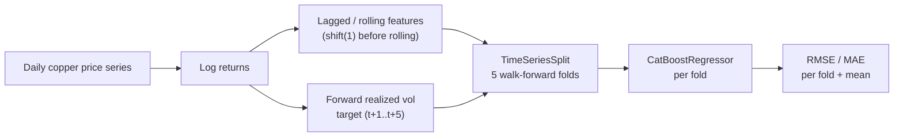

<div align="center">

# Copper Volatility Forecaster

**[English](README.md) | [Español](README.es.md)**


</div>

## Overview

This project forecasts **forward realized volatility** of copper prices: given
a history of daily prices, the model estimates how volatile the price will be
over the **next 5 trading days**. Volatility forecasts of this kind are a
standard input to hedge sizing, options pricing, and risk-limit calibration
for any desk or company with copper price exposure — a directly relevant
problem for Chile as the world's largest copper producer, where mining
revenue, national budget planning, and corporate hedging programs are all
sensitive to copper price volatility.

## Business value

- **Risk sizing**: a forward volatility estimate lets a treasury or trading
  desk size hedge positions (futures, options collars) to a target risk
  budget instead of a static rule of thumb.
- **Options pricing input**: realized-volatility forecasts are a direct input
  to pricing and marking illiquid or OTC copper derivatives where an implied
  volatility surface isn't readily available.
- **Budget and planning sensitivity**: for copper-exporting operations,
  knowing whether the market is entering a high- or low-volatility regime
  informs how conservatively revenue and covenant projections should be
  built.

## Architecture



The pipeline has three stages:

1. **Data layer** — loads a daily price series and computes log returns.
2. **Feature engineering layer** (Polars) — builds rolling volatility, rolling
   mean-return, short-lag return, and calendar features, every one of them
   computed strictly from information available before the day being
   predicted.
3. **Modeling and validation layer** — a `CatBoostRegressor` trained and
   evaluated across five walk-forward folds produced by scikit-learn's
   `TimeSeriesSplit`, so every validation fold is chronologically later than
   its training fold.

## Technology stack

| Layer | Technology | Role |
|---|---|---|
| Data manipulation | **Polars** | Fast, expression-based feature engineering over the price/return series |
| Modeling | **CatBoost** | Gradient-boosted regressor for the volatility target |
| Validation | **scikit-learn** (`TimeSeriesSplit`) | Strict walk-forward cross-validation |
| Hyperparameter search | **Optuna** | Installed and wired for the tuning phase (see Roadmap) |
| Runtime | **Python 3.10** | Project baseline |

## Methodology: avoiding lookahead bias

Volatility-forecasting pipelines are particularly exposed to data leakage,
because the "future" value being predicted (realized volatility) is derived
from the same return series the features are built from. Two rules are
enforced throughout the pipeline:

1. **Every feature is built from returns shifted by at least one day** before
   any rolling window is applied, so a feature computed for day *t* never
   uses the return realized on day *t* itself.
2. **Cross-validation uses exclusively `TimeSeriesSplit`** — a walk-forward
   split where every validation fold is strictly later in time than its
   training fold. A shuffled random K-fold is never used, since it would let
   the model train on future volatility regimes and validate against the
   past.

## Data

This version runs against a simulated daily copper price series with
GARCH(1,1) volatility clustering, so the series has genuine, recoverable
volatility regimes rather than flat, unstructured noise. This lets the full
pipeline — feature engineering, walk-forward validation, and model fitting —
be exercised and validated end to end ahead of connecting a real market data
feed (see Roadmap).

## Features

| Feature | Description |
|---|---|
| `realized_vol_{5,10,20,60}d` | Rolling standard deviation of past returns |
| `mean_return_{5,10,20,60}d` | Rolling mean of past returns |
| `lag_return_{1,2,3}` | Return 1/2/3 days ago |
| `day_of_week`, `month` | Calendar features, known in advance |

**Target**: `target_fwd_realized_vol` — standard deviation of returns over
days *t+1* through *t+5*, the quantity the model forecasts.

## Results

Output from a full run (3,000 simulated trading days, 2,934 rows after
feature/target construction, 5-fold `TimeSeriesSplit`):

```
[fold 1/5] train=  489 val=  489 RMSE=0.002423 MAE=0.001915
[fold 2/5] train=  978 val=  489 RMSE=0.002900 MAE=0.002315
[fold 3/5] train= 1467 val=  489 RMSE=0.002657 MAE=0.002195
[fold 4/5] train= 1956 val=  489 RMSE=0.003262 MAE=0.002560
[fold 5/5] train= 2445 val=  489 RMSE=0.002471 MAE=0.002000
------------------------------------------------------------
CV mean RMSE: 0.002743 (+/- 0.000309)
CV mean MAE : 0.002197 (+/- 0.000230)
```

RMSE/MAE are expressed in daily log-return units, the same scale as the
volatility target itself. A mean RMSE of ~0.0027 means the 5-day forward
volatility forecast is off by roughly 0.27 percentage points of daily return
volatility on average, small relative to the ~1–3% daily moves the underlying
process produces.

## Getting started

```powershell
py -m venv venv
./venv/Scripts/pip install -r requirements.txt
./venv/Scripts/python main.py
```

## Roadmap

- Connect a real sourced copper price series (LME/COMEX futures).
- Add an Optuna study to tune CatBoost hyperparameters per fold.
- Add SHAP-based feature-importance analysis.

## Author

**Pablo Reyes**

## License

MIT — see [LICENSE](LICENSE).
