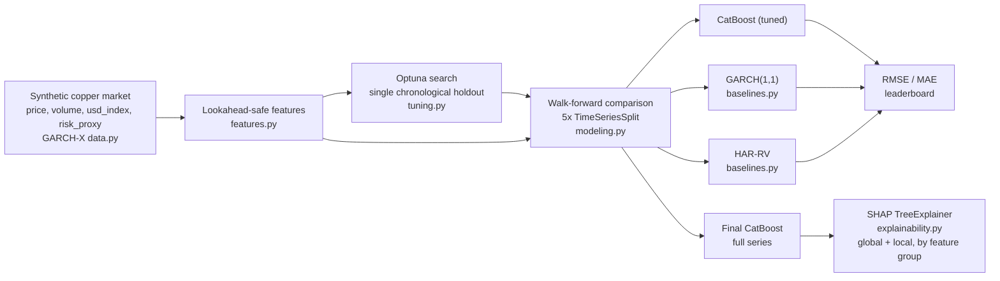

<div align="center">

# Copper Volatility Forecaster

**[English](README.md) | [Español](README.es.md)**


</div>

## Overview

This project forecasts **forward realized volatility** of copper prices: given
a history of daily prices, volume, and two macro proxies, the model estimates
how volatile the price will be over the **next 5 trading days**. Volatility
forecasts of this kind are a standard input to hedge sizing, options pricing,
and risk-limit calibration for any desk or company with copper price exposure
— a directly relevant problem for Chile as the world's largest copper
producer, where mining revenue, national budget planning, and corporate
hedging programs are all sensitive to copper price volatility.

The forecasting model — a CatBoost regressor tuned with **Optuna** — is
benchmarked against two classic econometric volatility baselines,
**GARCH(1,1)** and **HAR-RV** (Corsi, 2009), on identical walk-forward folds.
Explainability is computed with **SHAP** to quantify exactly how much
predictive weight the macro and volume features carry versus the pure
return-based ones.

## Business value

- **Risk sizing**: a forward volatility estimate lets a treasury or trading
  desk size hedge positions (futures, options collars) to a target risk
  budget instead of a static rule of thumb.
- **Options pricing input**: realized-volatility forecasts are a direct input
  to pricing and marking illiquid or OTC copper derivatives where an implied
  volatility surface isn't readily available.
- **Budget and planning sensitivity**: for copper-exporting operations,
  knowing whether the market is entering a high- or low-volatility regime
  informs how conservatively revenue and covenant projections should be
  built.
- **Macro-aware risk management**: quantifying how much of the volatility
  signal actually comes from USD strength and global risk sentiment (versus
  copper's own price action) tells a risk desk which external dashboards
  are actually worth watching for this exposure.

## Architecture



The pipeline has five stages:

1. **Data layer** (`src/data.py`) — generates a synthetic daily price,
   volume, and macro series with a documented, injected causal structure
   (GARCH-X: macro shocks feed the volatility equation with a one-day lag).
2. **Feature engineering layer** (`src/features.py`, Polars) — builds
   rolling return, volume, and macro features (every one computed strictly
   from information available before the day being predicted), plus the
   canonical HAR-RV daily/weekly/monthly components.
3. **Hyperparameter tuning** (`src/tuning.py`) — Optuna (TPE sampler) tunes
   CatBoost on a single chronological holdout split.
4. **Walk-forward benchmark** (`src/modeling.py`, `src/baselines.py`) — the
   tuned CatBoost, GARCH(1,1), and HAR-RV are all evaluated on the identical
   5-fold `TimeSeriesSplit`, so the comparison is apples-to-apples.
5. **Explainability** (`src/explainability.py`) — `shap.TreeExplainer` on
   the final CatBoost model, with global importance aggregated both per
   feature and per feature *group* (return / volume / macro / calendar).

## Technology stack

| Layer | Technology | Role |
|---|---|---|
| Data manipulation | **Polars** | Fast, expression-based feature engineering over the price/return/volume/macro series |
| Modeling | **CatBoost** | Gradient-boosted regressor for the volatility target |
| Hyperparameter search | **Optuna** | TPE-sampler tuning on a chronological holdout split |
| Econometric baselines | **arch** (GARCH), **statsmodels** (HAR-RV OLS) | Classic volatility-forecasting benchmarks, evaluated on identical walk-forward folds |
| Validation | **scikit-learn** (`TimeSeriesSplit`) | Strict walk-forward cross-validation |
| Explainability | **SHAP** (`TreeExplainer`) | Global (per-feature and per-group) and local (single-day) attribution |
| Runtime | **Python 3.10** | Project baseline |

## Methodology: avoiding lookahead bias

Volatility-forecasting pipelines are particularly exposed to data leakage,
because the "future" value being predicted (realized volatility) is derived
from the same return series the features are built from. Several rules are
enforced throughout the pipeline:

1. **Every feature is built from returns, volume, and macro values shifted
   by at least one day** before any rolling window is applied, so a feature
   computed for day *t* never uses information realized on day *t* itself.
2. **Cross-validation uses exclusively `TimeSeriesSplit`** across all three
   models — a walk-forward split where every validation fold is strictly
   later in time than its training fold.
3. **GARCH's information cutoff is matched to the ML features', not left
   implicit.** The `arch` package's rolling forecast, by default, uses the
   *actual realized return of the forecast origin day itself* to update its
   variance state before projecting forward — verified empirically, not
   assumed (see `src/baselines.py`'s docstring). Left uncorrected, this
   would give GARCH a one-day information advantage over CatBoost's
   `.shift(1)`-based features. The forecast is aligned to originate one day
   earlier and drop the now-mismatched first forecast step, so all three
   models see the identical information cutoff for every row.
4. **Optuna tunes on a single chronological holdout, not the full 5-fold
   CV** — an explicit, documented tradeoff to keep the search cost bounded
   (see `src/tuning.py`). The resulting hyperparameters are then evaluated
   across all 5 walk-forward folds for the reported leaderboard, so the
   comparison against GARCH/HAR-RV is still a full walk-forward evaluation.

## Data

This version runs against a simulated daily copper market (price, volume,
USD-index proxy, global risk/demand proxy) with **GARCH-X** volatility
clustering: the conditional variance follows a GARCH(1,1) recursion
augmented with lagged, squared macro shocks, so the macro series are
genuine — not decorative — leading indicators of copper volatility, and
volume is tied to the same underlying volatility path plus day-of-week
seasonality. All series are 100% synthetic and explicitly labeled as such;
see `src/data.py` for the full, documented causal structure. This lets the
full pipeline — feature engineering, tuning, walk-forward validation, and
explainability — be exercised and validated end to end ahead of connecting
real market data (see Roadmap).

## Features

| Group | Features | Description |
|---|---|---|
| Return | `realized_vol_{5,10,20,60}d`, `mean_return_{5,10,20,60}d`, `lag_return_{1,2,3}` | Rolling std/mean of past returns, short-lag returns |
| Volume | `log_volume_lag1`, `log_volume_roll_{mean,std}_{5,20}d` | Rolling statistics of log trading volume |
| Macro | `{usd_index,risk_proxy}_change_1d`, `..._roll_std_{5,20}d`, `..._roll_abs_mean_{5,20}d` | Rolling statistics of USD-index and risk-proxy changes |
| Calendar | `day_of_week`, `month` | Known in advance, no leakage |

**HAR-RV components** (used only by the HAR-RV baseline, kept separate from
the ML feature set to stay textbook-faithful): `har_rv_daily`,
`har_rv_weekly` (5d), `har_rv_monthly` (22d) — the canonical Corsi (2009)
horizons.

**Target**: `target_fwd_realized_vol` — standard deviation of returns over
days *t+1* through *t+5*, the quantity all three models forecast.

## Results

Output from a full run (3,000 simulated trading days, 2,934 rows after
feature/target construction, 30 Optuna trials, 5-fold `TimeSeriesSplit`):

```
Model            RMSE (mean)   RMSE (std)   MAE (mean)   MAE (std)
catboost            0.008163     0.002375     0.005921    0.001455
garch               0.007824     0.001822     0.005856    0.001017
har_rv              0.008076     0.002102     0.005867    0.001242
```

**GARCH(1,1) wins this benchmark** — and there's an honest, structural reason
for it, not a tuning failure to paper over: the synthetic series *is* a
GARCH-X process by construction (see Data above), so a correctly-specified
GARCH(1,1) recovers the generating alpha/beta persistence almost
analytically via maximum likelihood, while CatBoost has to approximate that
same recursive, multiplicative dynamic from a finite set of rolling-window
features — an inherently more indirect representation. CatBoost's edge would
come from nonlinearity or interactions GARCH can't express, and here the
macro signal it does add (10.8% of SHAP weight, see below) is a relatively
small, roughly linear addition that GARCH's own persistence already absorbs
indirectly through volatility clustering. HAR-RV — a 3-regressor linear
model — lands remarkably close to CatBoost despite its simplicity, a
reminder that realized-volatility forecasting has unusually strong classical
baselines, not easy strawmen.

**SHAP importance by feature group** (`outputs/shap_group_importance.csv`):

| Group | Share of total SHAP weight |
|---|---:|
| Volume | 41.35% |
| Return | 40.28% |
| Macro | 10.81% |
| Calendar | 7.56% |

The macro share isn't noise: SHAP recovers a real, non-trivial weight for
the exact `usd_index`/`risk_proxy` features that `src/data.py` injects as
genuine (lagged) drivers of the variance equation — validating the
explainability pipeline against a known ground truth, not just producing
plausible-looking numbers. Volume dominates, consistent with how the series
is constructed (volume is tied directly to the conditional-volatility path)
and with the real market-microstructure fact that volume leads/coincides
with volatility clustering.

Full RMSE/MAE-per-fold tables, the Optuna convergence plot, SHAP bar/beeswarm
plots, and a single-day local explanation are in
[`02_CatBoost_Optuna_GARCH_Comparison.ipynb`](02_CatBoost_Optuna_GARCH_Comparison.ipynb).

## Getting started

```powershell
py -m venv venv
./venv/Scripts/pip install -r requirements.txt
./venv/Scripts/python main.py
```

Writes all artifacts (model, SHAP values, Optuna history, walk-forward
comparison) to `outputs/`.

### Notebook

```powershell
./venv/Scripts/jupyter notebook 02_CatBoost_Optuna_GARCH_Comparison.ipynb
```

Requires having run `main.py` first.

### Tests

```powershell
./venv/Scripts/pytest -v
```

16 tests: no-overflow/finite-value checks on the synthetic generator,
lookahead-bias checks on the feature set (a same-day perturbation must not
change that day's own features, but must change the next day's), GARCH's
information-cutoff alignment with the ML features (verified by corruption
tests, not assumed), walk-forward comparison structure, Optuna search
sanity, and SHAP shape/aggregation invariants.

## Roadmap

- Connect a real sourced copper price/volume series (LME/COMEX futures) and
  real macro data (DXY, a genuine risk index) in place of the synthetic
  GARCH-X generator.
- Extend the GARCH baseline to a GARCH-X specification with the same macro
  regressors CatBoost sees, for a fairer test of whether ML's advantage
  survives once the econometric baseline can use the same information.
- Add a rolling/expanding hyperparameter re-tuning schedule instead of a
  single Optuna search reused across all 5 walk-forward folds.

## Author

**Pablo Reyes**

## License

MIT — see [LICENSE](LICENSE).
