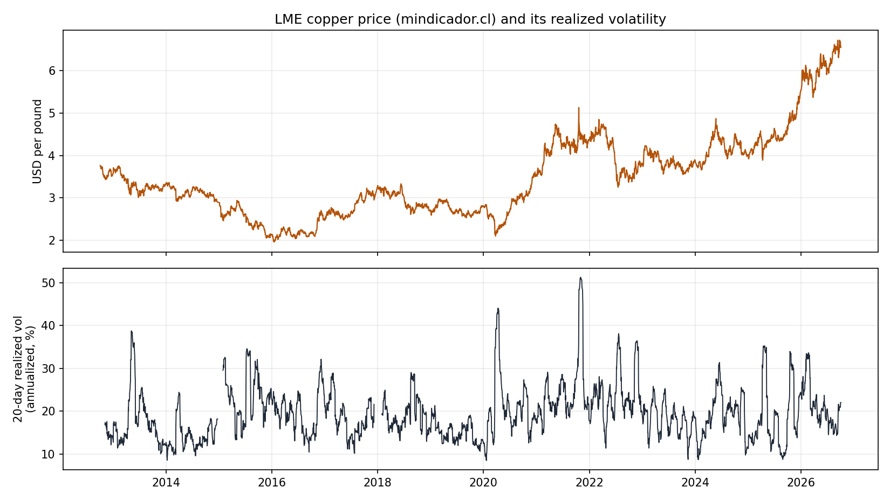
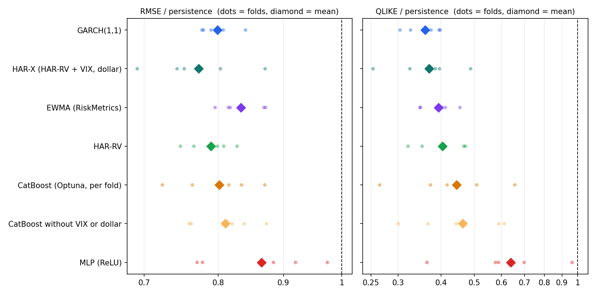
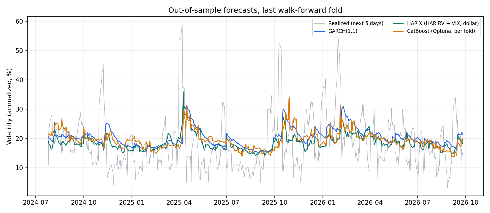
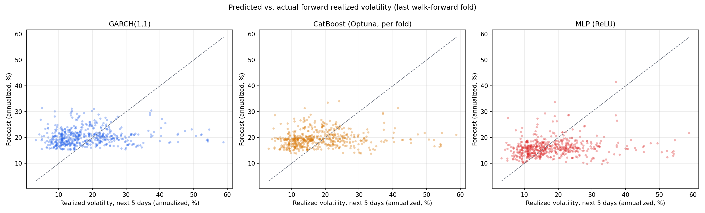
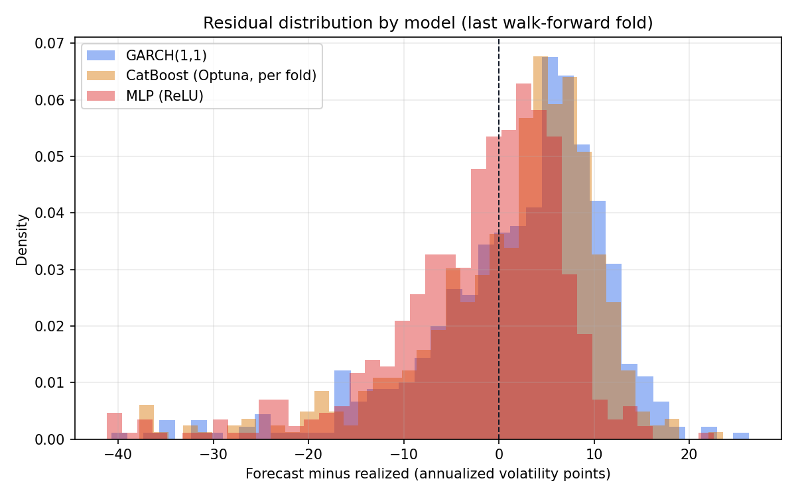
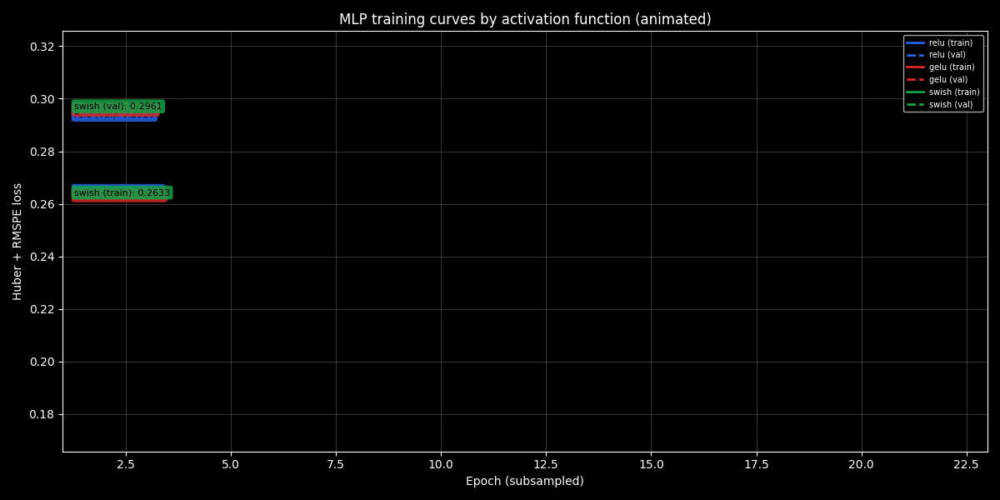
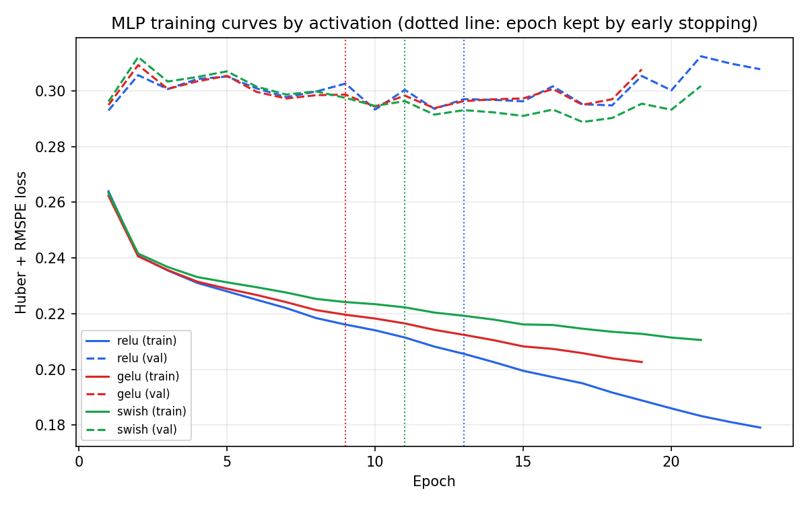

**[English](README.md) | [Español](README.es.md)**

# Copper Volatility Forecaster

[](https://github.com/Rxyxs/copper-volatility-forecaster/actions/workflows/ci.yml)  -2ea44f) 

On 14 years of real London Metal Exchange copper prices, a GARCH(1,1) from 1986 forecasts next week's volatility as well as anything else I tested: a CatBoost tuned with Optuna inside every walk-forward fold does not beat it, and the only model that ties it is a linear HAR-RV with the VIX and the dollar index added.

## What I found

| Finding | Evidence |
|---|---|
| **The 1986 model is still the one to beat** | Over 2,695 daily out-of-sample forecasts (July 2015 to September 2026), GARCH(1,1) has the lowest QLIKE, 0.380, and beats HAR-RV, EWMA and CatBoost on it (Diebold-Mariano p ≤ 0.022). On RMSE the four best models are statistically tied, between 8.59 and 8.86 annualized volatility points (p ≥ 0.22 against GARCH). |
| **Gradient boosting adds nothing here** | CatBoost, re-tuned with Optuna inside every fold on training data only, ends at QLIKE 0.455, worse than GARCH (p = 0.022). Its early stopping keeps between 10 and 95 trees in four of the five folds: once recent volatility is known, there is little structure left to learn. |
| **The VIX and the dollar help a little, not significantly** | SHAP puts 41% of the CatBoost model's weight on them, yet removing them worsens its QLIKE by only 4% (p = 0.33). Adding two of them to HAR-RV improves it by 9% (p = 0.13) and makes it the only model level with GARCH (p = 0.80). SHAP measures how much a model leans on a feature, not what the feature is worth. |
| **Every model beats "next week looks like last week"** | Against persistence, the econometric models and CatBoost cut RMSE by about 20% and QLIKE by about 60% (p < 0.001). The best neural network also beats it, but only after fixing two training problems, and it is still the weakest of the serious models (QLIKE 0.647). |
| **Most of a week's volatility is not forecastable** | No model explains as much as 10% of the variation in next week's realized volatility (Mincer-Zarnowitz R² below 0.10 for every one of them). The models track the *level* of risk; none anticipates a spike. |

## Why copper volatility

Chile is the world's largest copper producer, so the volatility of the copper price feeds directly into hedge sizing for mining companies and treasuries, the pricing of copper options and collars, and how conservatively revenue and fiscal projections are built. A five-day volatility forecast is the standard input for all three. The question here is whether machine learning improves on the classic econometric forecasts once the data is real and the evaluation is honest.

## Data

All three series are public, free and downloaded by the pipeline itself (`python main.py --download`). The analysis is frozen at `SAMPLE_END = 2026-10-02`, so rerunning it reproduces this README.

| Series | Source | Coverage | How it is used |
|---|---|---|---|
| Copper price, USD per pound | [mindicador.cl](https://mindicador.cl) (`libra_cobre`) | 3,435 days, 2012-10-05 to 2026-10-02 | Daily log returns, the target and the return features |
| VIX (CBOE) | [FRED](https://fred.stlouisfed.org/series/VIXCLS) `VIXCLS` | daily | Level and changes, only closes dated before the forecast day |
| Broad U.S. dollar index (Federal Reserve) | [FRED](https://fred.stlouisfed.org/series/DTWEXBGS) `DTWEXBGS` | daily, published weekly | Log changes, only once the weekly release containing them is out |

The copper series is the London price, not New York's: in July 2025, when COMEX traded above 5.5 USD/lb on tariff fears, it stayed between 4.4 and 4.6 USD/lb, about 9,700 to 10,100 USD per tonne, the LME level. Four things in the data needed handling before any model, all done explicitly in `src/data.py` and tested:

- **It follows the Chilean calendar.** On Chilean holidays the LME trades but the series has no value, so the next return spans more than one session: 95.3% of the returns cover one business day and 4.6% cover two to four. Those are kept as they are. Dividing them by the square root of the business days elapsed looks like the obvious fix, but it leaves them *less* volatile than an ordinary day (0.94% against 1.30% daily standard deviation), because many of those holidays are London holidays too. Doing it right needs the LME calendar, which is not in the data (see Roadmap).
- **Two real holes**, 7 business days around Christmas 2014 and 18 in December 2017. A return across five or more business days is not a daily return, so it is set to null and never used.
- **One duplicated day**, collapsed because both copies are identical (a day with two different prices would stop the pipeline).
- **The dollar index arrives a week late.** The Federal Reserve publishes it once a week (H.10, Monday afternoon) with data through the previous Friday. Using the daily value would use information nobody had yet, so each row only sees values already released: between 4 and 10 days old.

There is no free daily volume series for LME copper (mindicador has none and stooq blocks scripted downloads), so the volume features of the first, simulated version of this project are gone.



Fourteen years of the LME price and its 20-day realized volatility, which averages about 21% a year and spikes to 44% in April 2020 and 51% in November 2021, after the October 2021 squeeze on the LME's nearby contracts.

## Method

- **Target:** realized volatility over the next five trading days, the root mean square of the daily log returns (reported annualized, ×√245.5, the observed days per year).
- **Validation:** five expanding walk-forward folds (`TimeSeriesSplit`) of 539 days each. Every model sees the same folds and the same information cutoff: returns through the day before the forecast.
- **Models:** persistence (the last five days), EWMA (RiskMetrics, λ = 0.94), GARCH(1,1), HAR-RV (Corsi, 2009), HAR-X (HAR-RV plus the VIX level and the dollar's 20-day volatility, chosen before seeing any result), CatBoost with 24 features, CatBoost without the 11 macro features, and a PyTorch MLP with three activations.
- **No tuning on the scored data:** CatBoost is re-tuned with 30 Optuna trials inside every fold, on that fold's training block; the last 20% of the block is the holdout for both Optuna and early stopping. The MLP uses the same holdout to stop. A test rewrites a fold's validation targets and checks that its forecasts do not change.
- **Metrics:** RMSE in annualized volatility points, and **QLIKE** (Patton, 2011) as the ranking metric. With a noisy proxy such as five-day realized volatility, QLIKE still ranks forecasts the way the true variance would, which RMSE on volatility does not guarantee, and it punishes under-forecasting risk harder than over-forecasting it. Differences are tested with Diebold-Mariano on the 2,695 pooled forecasts, with a Newey-West variance because consecutive five-day targets overlap.

## Results

| Model | RMSE (annualized vol. points) | QLIKE | RMSE vs. persistence | QLIKE vs. persistence |
|---|---:|---:|---:|---:|
| GARCH(1,1) | 8.79 | 0.380 | 0.80 | 0.36 |
| HAR-X (HAR-RV + VIX, dollar) | 8.59 | 0.385 | 0.78 | 0.36 |
| EWMA (RiskMetrics) | 9.21 | 0.417 | 0.83 | 0.39 |
| HAR-RV | 8.66 | 0.422 | 0.79 | 0.40 |
| CatBoost (Optuna, re-tuned per fold) | 8.86 | 0.455 | 0.80 | 0.43 |
| CatBoost without VIX or dollar | 8.90 | 0.473 | 0.81 | 0.44 |
| MLP (ReLU) | 9.45 | 0.647 | 0.86 | 0.61 |
| MLP (GELU) | 9.64 | 0.686 | 0.87 | 0.64 |
| MLP (Swish) | 9.73 | 0.724 | 0.88 | 0.68 |
| Persistence (last 5 days) | 11.03 | 1.066 | 1.00 | 1.00 |

Sorted by QLIKE. Below 1 in the last two columns means better than assuming the next five days will look like the last five.

| Comparison (Diebold-Mariano) | p-value, QLIKE | p-value, RMSE | Reading |
|---|---:|---:|---|
| HAR-X vs. GARCH(1,1) | 0.798 | 0.396 | Tie |
| CatBoost vs. GARCH(1,1) | 0.022 | 0.703 | GARCH better on QLIKE, tie on RMSE |
| HAR-RV vs. GARCH(1,1) | < 0.001 | 0.218 | GARCH better on QLIKE, tie on RMSE |
| EWMA vs. GARCH(1,1) | < 0.001 | < 0.001 | GARCH better |
| CatBoost vs. CatBoost without VIX or dollar | 0.334 | 0.735 | No detectable gain from the macro inputs |
| HAR-X vs. HAR-RV | 0.127 | 0.763 | No detectable gain from the macro inputs |
| MLP (ReLU) vs. persistence | < 0.001 | < 0.001 | MLP better |



Each model's RMSE and QLIKE divided by persistence's, fold by fold, on a log scale: GARCH, HAR-X, HAR-RV and EWMA cluster together, CatBoost keeps up on RMSE but trails on QLIKE, and the MLPs sit closest to persistence.



The last fold, July 2024 to September 2026: the three best models follow the level of volatility, but none sees a spike coming, the April 2025 one included; they react afterwards. That is the limit of what a five-day volatility forecast can do.

## What the VIX and the dollar add

| Feature group | Share of SHAP weight |
|---|---:|
| Return | 57.94% |
| Macro (VIX, dollar index) | 41.32% |
| Calendar | 0.74% |

On the full-series CatBoost model, the 60-day realized volatility is the single most important feature, followed by the 20-day volatility of the VIX's daily changes. Read alone, that would say the macro inputs matter a lot. The ablations say otherwise: CatBoost without them is 4% worse on QLIKE and HAR-RV with two of them is 9% better, and neither difference is distinguishable from zero over eleven years of forecasts. The macro series move with copper's volatility, so a tree model happily uses them, but most of what they carry is already in copper's own recent volatility.

## Third approach: PyTorch MLP (activation comparison)

`src/deep_learning.py` trains a small feed-forward network (two hidden layers, Softplus output so forecasts stay positive) on the same 24 features, folds and target, with a Huber plus relative-error loss, and compares ReLU, GELU and Swish. On real data it exposed two problems that the first, simulated version of the project carried silently:

- **The loss was mis-scaled.** On raw daily volatilities (around 0.01) the Huber term is about 0.00001 and the relative term about 0.1, so the network trained on the relative term alone, which rewards forecasting too little: it forecast about half the realized volatility (median 0.0058 against 0.0112) and almost zero on 12% of the days, which sent its QLIKE into the millions. The target is now divided by its training-fold mean, so both terms weigh what the design says.
- **Sixty fixed epochs overfit.** The validation loss bottomed around epoch 20 and climbed after it. Training now stops on the last 20% of the training block, as CatBoost does, and keeps the best epoch: between 2 and 16 depending on fold and activation.

With both fixed, the ReLU network beats persistence (QLIKE 0.647 against 1.066, p < 0.001) but remains the weakest of the serious models. With 2,700 days of noisy targets, a small network has no edge over a model with three parameters.



Forecasts against realized volatility in the last fold: every model compresses its forecasts into a narrow band, because most of a single week's volatility is noise that no forecast can follow.



The errors are skewed: the models over-forecast calm weeks by a few points and under-forecast the rare turbulent ones by much more, which is exactly what QLIKE penalizes.



Training and validation loss per epoch, drawn as the training happened.



The same curves with the epoch kept by early stopping marked: training loss keeps falling while validation loss stays flat around 0.30 from the first epochs.

## Avoiding lookahead bias

1. **Copper features only use returns through the day before.** Every rolling window runs over `log_return.shift(1)`; a test perturbs one day's price and checks that the features for that day do not move while the next day's do.
2. **Macro features are joined by publication date.** The VIX enters with closes up to the previous calendar day; the dollar index only once its weekly release is out. Both are tested by perturbing a value on the exact day it should, and should not, become visible.
3. **GARCH has the same information cutoff as the features.** `arch`'s rolling forecast at origin *o* updates its variance with the return of day *o* itself (verified empirically, not assumed), so row *i*'s forecast is taken from origin *i−1*, asking for a (horizon+1)-step forecast and dropping its first step.
4. **Nothing is tuned or stopped on the data it is scored on.** Optuna, CatBoost's early stopping and the MLP's early stopping all use the end of the training block; tests rewrite a fold's validation targets and check that its forecasts stay identical.

## What changed from the first version

The first version of this project ran on a simulated GARCH-X market, where GARCH won by construction. Moving it to real data changed more than the numbers:

- **Data:** the real LME copper price, VIX and dollar index replace the simulated series; volume is gone because no free real series exists.
- **Leakage removed:** CatBoost used to early-stop on the validation fold it was scored on, and Optuna tuned once on the last 20% of the series, which overlaps the last fold. Both now use only the training block of each fold.
- **The MLP's loss scale and fixed epoch count** were fixed, as described above.
- **Evaluation:** persistence, EWMA and HAR-X baselines, QLIKE, Diebold-Mariano tests and the macro ablation are new. The target is now the root mean square of the next five returns, the quantity a zero-mean GARCH forecasts, instead of their sample standard deviation.

GARCH(1,1) still comes out on top, and this time not because the data was built for it.

## Technology stack

| Layer | Technology | Role |
|---|---|---|
| Data | **urllib**, **Polars** | Download, validation and lookahead-safe feature engineering |
| Econometrics | **arch** (GARCH), **statsmodels** (HAR-RV, Newey-West) | Baselines and Diebold-Mariano tests |
| Machine learning | **CatBoost**, **Optuna**, **scikit-learn** | Gradient boosting, per-fold tuning, walk-forward splits |
| Deep learning | **PyTorch** | MLP with three activation functions |
| Explainability | **SHAP** | Feature and feature-group attribution |
| Storage | **DuckDB** | Metrics and out-of-sample forecasts per run |

## Getting started

```powershell
py -m venv venv
./venv/Scripts/pip install -r requirements.txt
./venv/Scripts/python main.py --download   # once: 17 raw files from mindicador.cl and FRED into data/raw/
./venv/Scripts/python main.py              # about 15 minutes on a laptop CPU
```

It writes the figures to `reports/figures/`, the summary behind every number in this README to `reports/results.json`, and the full artifacts (SHAP values, the CatBoost model, the Optuna history, a DuckDB file with every forecast) to `outputs/`. The notebook [`02_CatBoost_Optuna_GARCH_Comparison.ipynb`](02_CatBoost_Optuna_GARCH_Comparison.ipynb) reads those artifacts.

### Tests

```powershell
./venv/Scripts/pytest -v
```

57 tests, no network needed (the pipeline's tests run on a small simulated market with the same schema as the real one): validation of the raw files (duplicates, weekend dates, wrong units, holes), the dollar index's publication cutoff, lookahead checks on every feature group, GARCH's information cutoff, a test that a fold never sees its own validation targets, QLIKE and Diebold-Mariano, the MLP's early stopping, plots, DuckDB persistence, and a check that every number in both READMEs' results table matches `reports/results.json`.

## Roadmap

- Use the LME holiday calendar to scale returns that span more than one session, instead of keeping them as single days.
- Intraday prices, to build realized variance from five-minute returns: the standard input for HAR-RV, far less noisy than a daily root mean square.
- A GARCH-X with the VIX in the variance equation, to test the macro inputs inside the model that wins.
- A longer copper history: mindicador starts in October 2012.

## License

MIT — see [LICENSE](LICENSE).

## Author

**Pablo Reyes** — [github.com/Rxyxs](https://github.com/Rxyxs)
